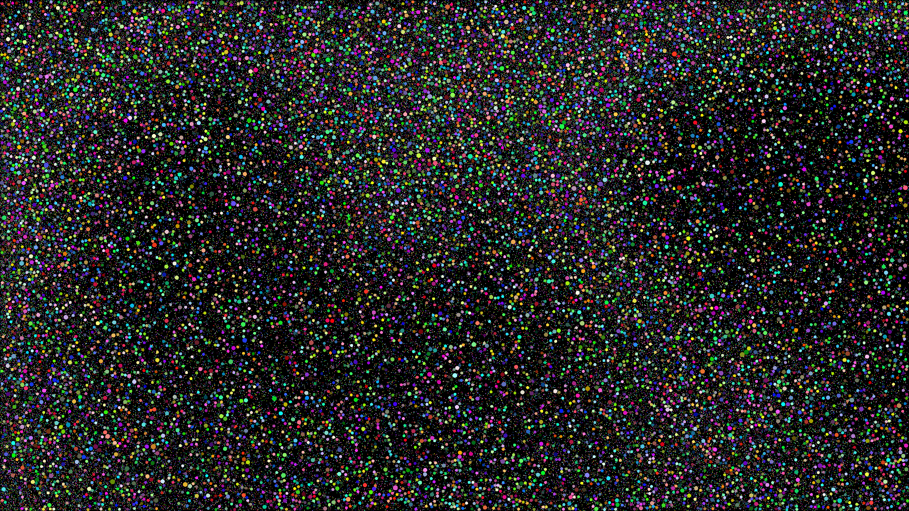

# Particle simulator

As part of an interview process I was asked to write a simulation where circles
affected by gravity interact with each other. The goal was to simulate as many
circles as possible. This implementation uses OpenGL with simple vertex and fragment
shaders and OpenMP for multithreading. To accelerate collision detection, 
**sweep-and-prune** and **spatial partitioning** in the form of a grid is used.

This implementation is capable of simulating several hundred thousands of
particles. However, the physics of the simulation isn't very interesting at the
moment. Particles do not lose energy when bouncing off of each other or the
borders of the screen. One *may* run into the odd segfault, especially when
the particles can't fit on the screen. Choose input accordingly.

## Build
```
g++ -o circle-sim3 circle-sim3.cpp -lglfw -lGLU -lGL -lGLEW -fopenmp -O3
```

## Usage
```
./circle-sim3 <width> <height> <minRadius> <maxRadius> <spawnLimit> <gravity>
```
Example:
```
./circle-sim3 2400 1350 1 7 120000 0.05
```
